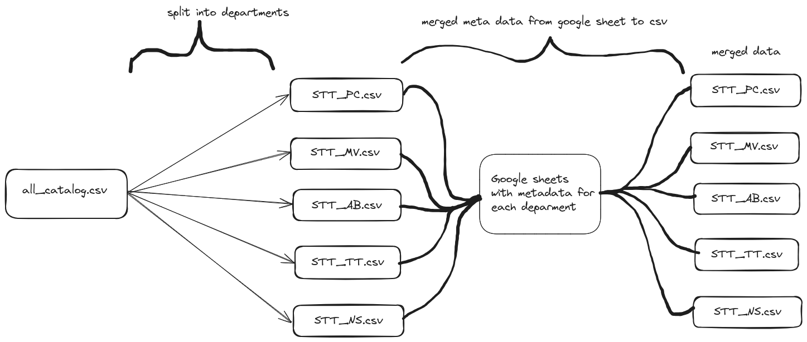

<h1 align="center">
   
  
   
</h1>

<!-- Replace with 1-sentence description about what this tool is or does.-->

<h3 align="center">stt catalog merger</h3>

## Description

# Departments and its meta data added in the final csv files:
1. STT_PC : [
                "Publishing year",
                "Channel",
                "Auidio Quality",
                "Country",
                "Gender",
                "Age Group",
                "uploaded"]
   
3. STT_TT : [
                "Teacher",
                "Topic",
                "Audio Duration",
                "Group",
            ]
   
4. STT_MV : [
                "Name of the movie",
                "Subtitle",
                "Repo Link",
                "Duration",
            ]
   
5. STT_NS : [
               "Date",
                "Time ",
                "Mic/Phone",
                "Location ",
                "Topic ",
                "ID",
                "Speaker ID",
                "Gender",
                "Audio Duration",
                "Group",
                "Pecha Tools",
                "A Short Scenario ",
                "Sum",
                "Gender"    ]
   
7. STT_AB : [
                "ID",
                "Collection",
                "Book Title",
                "Category",
                "Duration",
                "Recorder",
                "pecha.tools",
                "Music",
                "Book URL"   ]
   
## Project owner(s)

<!-- Link to the repo owners' github profiles -->

- [@10zinten](https://github.com/10zinten)
- [@evanyerburgh](https://github.com/evanyerburgh)

## Integrations

<!-- Add any intregrations here or delete `- ` and write None-->

None
## Docs

<!-- Update the link to the docs -->

Read the docs [here](https://wiki.openpecha.org/#/dev/coding-guidelines).
